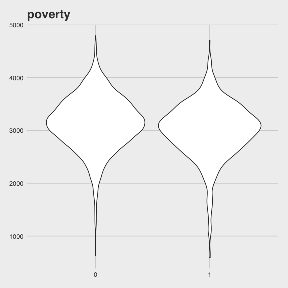
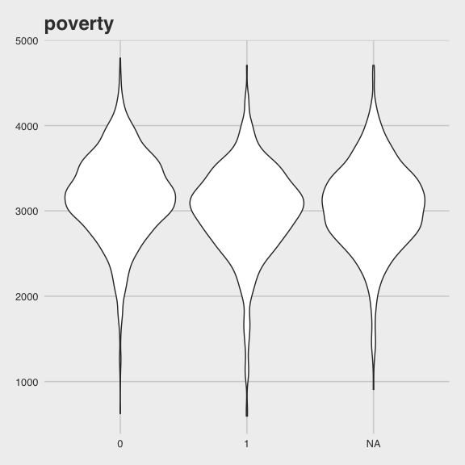
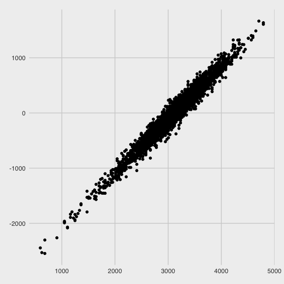

p8105 hw6
================
Alexey Abramov
12/8/2020

  - [Setup](#setup)
  - [Loading the data.](#loading-the-data.)
  - [Problem 1](#problem-1)
      - [Data wrangling](#data-wrangling)
      - [Odds Ratio Plot Across 50
        Cities](#odds-ratio-plot-across-50-cities)
  - [Problem 2](#problem-2)
      - [Cleaning up the data.](#cleaning-up-the-data.)
      - [Build a model](#build-a-model)
  - [Problem 3](#problem-3)

# Setup

``` r
library(tidyverse)
```

    ## ── Attaching packages ─────────────────── tidyverse 1.3.0 ──

    ## ✓ ggplot2 3.3.2     ✓ purrr   0.3.4
    ## ✓ tibble  3.0.3     ✓ dplyr   1.0.2
    ## ✓ tidyr   1.1.2     ✓ stringr 1.4.0
    ## ✓ readr   1.3.1     ✓ forcats 0.5.0

    ## ── Conflicts ────────────────────── tidyverse_conflicts() ──
    ## x dplyr::filter() masks stats::filter()
    ## x dplyr::lag()    masks stats::lag()

``` r
library(readr)
library(plotly)
```

    ## 
    ## Attaching package: 'plotly'

    ## The following object is masked from 'package:ggplot2':
    ## 
    ##     last_plot

    ## The following object is masked from 'package:stats':
    ## 
    ##     filter

    ## The following object is masked from 'package:graphics':
    ## 
    ##     layout

``` r
library(purrr)
library(broom)
library(modelr)
```

    ## 
    ## Attaching package: 'modelr'

    ## The following object is masked from 'package:broom':
    ## 
    ##     bootstrap

``` r
library(mgcv)
```

    ## Loading required package: nlme

    ## 
    ## Attaching package: 'nlme'

    ## The following object is masked from 'package:dplyr':
    ## 
    ##     collapse

    ## This is mgcv 1.8-33. For overview type 'help("mgcv-package")'.

``` r
knitr::opts_chunk$set(
  fig.width = 6,
  fig.height = 6,
  out.width = "90%"
)

theme_set(
  ggthemes::theme_fivethirtyeight() + theme(legend.position = "bottom")
  )

options(
  ggplot2.continuous.colour = "viridis",
  ggplot2.continuous.colour = "viridis"
)

scale_colour_discrete = scale_color_viridis_d
scale_fill_discrete = scale_fill_viridis_d
```

# Loading the data.

Here we are able to filter race to black and white, for better
understanding the regression

# Problem 1

``` r
homicide_df = 
  read_csv("homicide_data/homicide-data.csv") %>% 
  mutate(
    victim_age = as.numeric(victim_age),
    city_state = str_c(city, state, sep = "_"),
    resolution = case_when(
      disposition == "Closed without arrest"  ~ 0,
      disposition == "Open/No arrest"         ~0,
      disposition == "Closed by arrest"      ~1)) %>% 
  filter(
    city_state != "Tulsa_AL",
    victim_race %in% c("White", "Black")) %>% 
  select(city_state, resolution, victim_age, victim_race, victim_sex)
```

    ## Parsed with column specification:
    ## cols(
    ##   uid = col_character(),
    ##   reported_date = col_double(),
    ##   victim_last = col_character(),
    ##   victim_first = col_character(),
    ##   victim_race = col_character(),
    ##   victim_age = col_character(),
    ##   victim_sex = col_character(),
    ##   city = col_character(),
    ##   state = col_character(),
    ##   lat = col_double(),
    ##   lon = col_double(),
    ##   disposition = col_character()
    ## )

    ## Warning: Problem with `mutate()` input `victim_age`.
    ## ℹ NAs introduced by coercion
    ## ℹ Input `victim_age` is `as.numeric(victim_age)`.

    ## Warning in mask$eval_all_mutate(dots[[i]]): NAs introduced by coercion

## Data wrangling

So now the regression is alphabetical with the predictor variables.

``` r
baltimore_df =
  homicide_df %>% 
  filter(city_state == "Baltimore_MD")

glm(resolution ~ victim_age + victim_race + victim_sex, 
    data = baltimore_df,
    family = binomial()) %>% 
  broom::tidy()
```

    ## # A tibble: 4 x 5
    ##   term             estimate std.error statistic  p.value
    ##   <chr>               <dbl>     <dbl>     <dbl>    <dbl>
    ## 1 (Intercept)       0.310     0.171        1.81 7.04e- 2
    ## 2 victim_age       -0.00673   0.00332     -2.02 4.30e- 2
    ## 3 victim_raceWhite  0.842     0.175        4.82 1.45e- 6
    ## 4 victim_sexMale   -0.854     0.138       -6.18 6.26e-10

Fixing it up, looking clean

``` r
baltimore_df =
  homicide_df %>% 
  filter(city_state == "Baltimore_MD")

glm(resolution ~ victim_age + victim_race + victim_sex, 
    data = baltimore_df,
    family = binomial()) %>% 
  broom::tidy() %>% 
  mutate(
    OR = exp(estimate),
    CI_lower = exp(estimate - 1.96 * std.error),
    CI_upper = exp(estimate + 1.96 * std.error)) %>% 
  select(term, OR, starts_with("CI")) %>% 
  knitr::kable(digits = 3)
```

| term              |    OR | CI\_lower | CI\_upper |
| :---------------- | ----: | --------: | --------: |
| (Intercept)       | 1.363 |     0.975 |     1.907 |
| victim\_age       | 0.993 |     0.987 |     1.000 |
| victim\_raceWhite | 2.320 |     1.648 |     3.268 |
| victim\_sexMale   | 0.426 |     0.325 |     0.558 |

Trying this across multiple cities now. Here we are mapping across our
dataframe (.x = data), and then (data = .x) appears later in the
argument.

Then we create a results column which has the broom tidy output from the
model call, and then we will unnest it.

``` r
model_results_df = homicide_df %>% 
  nest(data = -city_state) %>% 
  mutate(
    models = 
      map(.x = data, ~glm(resolution ~ victim_age + victim_race + victim_sex, data = .x,
    family = binomial())),
    results = map(models, broom::tidy)
    ) %>% 
  select(city_state, results) %>% 
  unnest(results) %>% 
  mutate(
    OR = exp(estimate),
    CI_lower = exp(estimate - 1.96 * std.error),
    CI_upper = exp(estimate + 1.96 * std.error)) %>% 
  select(city_state, term, OR, starts_with("CI"))
```

## Odds Ratio Plot Across 50 Cities

``` r
model_results_df %>% 
  filter(term == "victim_sexMale") %>% 
  mutate(city_state = fct_reorder(city_state, OR)) %>% 
  ggplot(aes(x = city_state, y = OR)) +
  geom_point() + 
  geom_errorbar(aes(ymin = CI_lower, ymax = CI_upper)) + 
  theme(axis.text.x = element_text(angle = 90, vjust = 0.5, hjust = 1))
```


# Problem 2

tips and tricks Start with the models and then perform cross-validation

Model building, look at the p values, residuals,

## Cleaning up the data.

I first looked up the poverty level for a family of three in the Dept
HHS 2018 guidelines, which was $20,780 per year and so that’s approx
$1800 per month.

I wanted to consider the poverty variable, but looks like this dataset
doesn’t quite represent a population of American households because very
few have a monthly income that’s \<$1800 per month.

``` r
baby_df = 
  read_csv("./birthweight_data/birthweight.csv") %>% 
  mutate(
    babysex = as.factor(babysex),
    malform = as.factor(malform),
    poverty = case_when(
      fincome <18  ~ 1,
      fincome >18  ~ 0),
    poverty = as.factor(poverty))
```

    ## Parsed with column specification:
    ## cols(
    ##   .default = col_double()
    ## )

    ## See spec(...) for full column specifications.

So instead, maybe I’ll just take a look at the summary here and see
about families in the lowest quartile vs. others.

``` r
baby_df %>% pull(fincome) %>% summary()
```

    ##    Min. 1st Qu.  Median    Mean 3rd Qu.    Max. 
    ##    0.00   25.00   35.00   44.11   65.00   96.00

Plots to consider

``` r
baby_df %>% 
  ggplot(aes(x = poverty, y = bwt)) +
  geom_violin() + 
  labs(title = "poverty")
```


About similar, slightly lower birthweight in the poverty cohort.

``` r
baby_df %>% 
  ggplot(aes(x = momage, y = bwt)) +
  geom_point() + 
  labs(title = "mom age")
```


Interesting, a lot of variability in young mothers and then looks like
slightly lower birthweight in older mothers.

``` r
baby_df %>% 
  filter(smoken > 0) %>% 
  ggplot(aes(x = smoken, y = bwt)) +
  geom_point() + 
  labs(title = "smoking")
```


Filtered out non-smokers for the purposes of the plot, looks again like
maybe more smoking suggests lower birthweight.

``` r
baby_df %>% 
  filter(smoken > 0) %>% 
  ggplot(aes(x = gaweeks, y = bwt)) +
  geom_point() + 
  labs(title = "ga age")
```


``` r
baby_df = 
  read_csv("./birthweight_data/birthweight.csv") %>% 
  mutate(
    babysex = as.factor(babysex),
    malform = as.factor(malform),
    poverty = case_when(
      fincome <25  ~ 1,
      fincome >25  ~ 0))
```

    ## Parsed with column specification:
    ## cols(
    ##   .default = col_double()
    ## )

    ## See spec(...) for full column specifications.

Ok, I think this may be more reasonable for a model to consider a
poverty level that includes families in the lowest quartile of family
income.

## Build a model

``` r
poverty_model = lm(bwt ~ poverty + smoken + momage, data = baby_df) 

poverty_model %>%  
  broom::tidy()  %>% 
  select(term, estimate, p.value)
```

    ## # A tibble: 4 x 3
    ##   term        estimate  p.value
    ##   <chr>          <dbl>    <dbl>
    ## 1 (Intercept)  2898.   0.      
    ## 2 poverty      -143.   3.45e-11
    ## 3 smoken         -7.43 5.38e-11
    ## 4 momage         14.3  1.45e-10

Adding residuals and plotting.

``` r
baby_df %>% 
  modelr::add_residuals(poverty_model) %>% 
  ggplot(aes(x = bwt, y = resid)) +
  geom_point()
```

    ## Warning: Removed 864 rows containing missing values (geom_point).



Looks pretty darn linear.

# Problem 3
