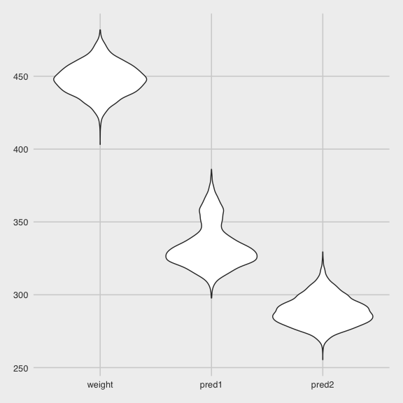

p8105 hw6
================
Alexey Abramov
12/8/2020

  - [Setup](#setup)
  - [Loading the data.](#loading-the-data.)
  - [Problem 1](#problem-1)
      - [Data wrangling](#data-wrangling)
      - [Odds Ratio Plot Across 50
        Cities](#odds-ratio-plot-across-50-cities)
  - [Problem 2](#problem-2)
      - [Cleaning up the data.](#cleaning-up-the-data.)
      - [Plots to consider](#plots-to-consider)
      - [Building a model](#building-a-model)
          - [take 1](#take-1)
          - [take 2](#take-2)
      - [Building the two other models in this assignment for
        consideration.](#building-the-two-other-models-in-this-assignment-for-consideration.)
  - [Problem 3](#problem-3)

# Setup

``` r
library(tidyverse)
```

    ## ── Attaching packages ────────────────────────────────────────────── tidyverse 1.3.0 ──

    ## ✓ ggplot2 3.3.2     ✓ purrr   0.3.4
    ## ✓ tibble  3.0.3     ✓ dplyr   1.0.2
    ## ✓ tidyr   1.1.2     ✓ stringr 1.4.0
    ## ✓ readr   1.3.1     ✓ forcats 0.5.0

    ## ── Conflicts ───────────────────────────────────────────────── tidyverse_conflicts() ──
    ## x dplyr::filter() masks stats::filter()
    ## x dplyr::lag()    masks stats::lag()

``` r
library(readr)
library(plotly)
```

    ## 
    ## Attaching package: 'plotly'

    ## The following object is masked from 'package:ggplot2':
    ## 
    ##     last_plot

    ## The following object is masked from 'package:stats':
    ## 
    ##     filter

    ## The following object is masked from 'package:graphics':
    ## 
    ##     layout

``` r
library(purrr)
library(broom)
library(modelr)
```

    ## 
    ## Attaching package: 'modelr'

    ## The following object is masked from 'package:broom':
    ## 
    ##     bootstrap

``` r
library(mgcv)
```

    ## Loading required package: nlme

    ## 
    ## Attaching package: 'nlme'

    ## The following object is masked from 'package:dplyr':
    ## 
    ##     collapse

    ## This is mgcv 1.8-33. For overview type 'help("mgcv-package")'.

``` r
knitr::opts_chunk$set(
  fig.width = 6,
  fig.height = 6,
  out.width = "90%"
)

theme_set(
  ggthemes::theme_fivethirtyeight() + theme(legend.position = "bottom")
  )

options(
  ggplot2.continuous.colour = "viridis",
  ggplot2.continuous.colour = "viridis"
)

scale_colour_discrete = scale_color_viridis_d
scale_fill_discrete = scale_fill_viridis_d
```

# Loading the data.

Here we are able to filter race to black and white, for better
understanding the regression

# Problem 1

``` r
homicide_df = 
  read_csv("homicide_data/homicide-data.csv") %>% 
  mutate(
    victim_age = as.numeric(victim_age),
    city_state = str_c(city, state, sep = "_"),
    resolution = case_when(
      disposition == "Closed without arrest"  ~ 0,
      disposition == "Open/No arrest"         ~0,
      disposition == "Closed by arrest"      ~1)) %>% 
  filter(
    city_state != "Tulsa_AL",
    victim_race %in% c("White", "Black")) %>% 
  select(city_state, resolution, victim_age, victim_race, victim_sex)
```

    ## Parsed with column specification:
    ## cols(
    ##   uid = col_character(),
    ##   reported_date = col_double(),
    ##   victim_last = col_character(),
    ##   victim_first = col_character(),
    ##   victim_race = col_character(),
    ##   victim_age = col_character(),
    ##   victim_sex = col_character(),
    ##   city = col_character(),
    ##   state = col_character(),
    ##   lat = col_double(),
    ##   lon = col_double(),
    ##   disposition = col_character()
    ## )

    ## Warning: Problem with `mutate()` input `victim_age`.
    ## ℹ NAs introduced by coercion
    ## ℹ Input `victim_age` is `as.numeric(victim_age)`.

    ## Warning in mask$eval_all_mutate(dots[[i]]): NAs introduced by coercion

## Data wrangling

So now the regression is alphabetical with the predictor variables.

``` r
baltimore_df =
  homicide_df %>% 
  filter(city_state == "Baltimore_MD")

glm(resolution ~ victim_age + victim_race + victim_sex, 
    data = baltimore_df,
    family = binomial()) %>% 
  broom::tidy()
```

    ## # A tibble: 4 x 5
    ##   term             estimate std.error statistic  p.value
    ##   <chr>               <dbl>     <dbl>     <dbl>    <dbl>
    ## 1 (Intercept)       0.310     0.171        1.81 7.04e- 2
    ## 2 victim_age       -0.00673   0.00332     -2.02 4.30e- 2
    ## 3 victim_raceWhite  0.842     0.175        4.82 1.45e- 6
    ## 4 victim_sexMale   -0.854     0.138       -6.18 6.26e-10

Fixing it up, looking clean

``` r
baltimore_df =
  homicide_df %>% 
  filter(city_state == "Baltimore_MD")

glm(resolution ~ victim_age + victim_race + victim_sex, 
    data = baltimore_df,
    family = binomial()) %>% 
  broom::tidy() %>% 
  mutate(
    OR = exp(estimate),
    CI_lower = exp(estimate - 1.96 * std.error),
    CI_upper = exp(estimate + 1.96 * std.error)) %>% 
  select(term, OR, starts_with("CI")) %>% 
  knitr::kable(digits = 3)
```

| term              |    OR | CI\_lower | CI\_upper |
| :---------------- | ----: | --------: | --------: |
| (Intercept)       | 1.363 |     0.975 |     1.907 |
| victim\_age       | 0.993 |     0.987 |     1.000 |
| victim\_raceWhite | 2.320 |     1.648 |     3.268 |
| victim\_sexMale   | 0.426 |     0.325 |     0.558 |

Trying this across multiple cities now. Here we are mapping across our
dataframe (.x = data), and then (data = .x) appears later in the
argument.

Then we create a results column which has the broom tidy output from the
model call, and then we will unnest it.

``` r
model_results_df = homicide_df %>% 
  nest(data = -city_state) %>% 
  mutate(
    models = 
      map(.x = data, ~glm(resolution ~ victim_age + victim_race + victim_sex, data = .x,
    family = binomial())),
    results = map(models, broom::tidy)
    ) %>% 
  select(city_state, results) %>% 
  unnest(results) %>% 
  mutate(
    OR = exp(estimate),
    CI_lower = exp(estimate - 1.96 * std.error),
    CI_upper = exp(estimate + 1.96 * std.error)) %>% 
  select(city_state, term, OR, starts_with("CI"))
```

## Odds Ratio Plot Across 50 Cities

``` r
model_results_df %>% 
  filter(term == "victim_sexMale") %>% 
  mutate(city_state = fct_reorder(city_state, OR)) %>% 
  ggplot(aes(x = city_state, y = OR)) +
  geom_point() + 
  geom_errorbar(aes(ymin = CI_lower, ymax = CI_upper)) + 
  theme(axis.text.x = element_text(angle = 90, vjust = 0.5, hjust = 1))
```


# Problem 2

tips and tricks Start with the models and then perform cross-validation

Model building, look at the p values, residuals,

## Cleaning up the data.

I first looked up the poverty level for a family of three in the Dept
HHS 2018 guidelines, which was $20,780 per year and so that’s approx
$1800 per month.

I wanted to consider a ‘poverty’ variable, but looks like this dataset
doesn’t quite represent a true population of American households as very
few have a monthly income that’s \<$1800 per month.

``` r
baby_df = 
  read_csv("./birthweight_data/birthweight.csv") %>% 
  mutate(
    babysex = as.factor(babysex),
    malform = as.factor(malform),
    poverty = case_when(
      fincome <18  ~ 1,
      fincome >18  ~ 0),
    poverty = as.factor(poverty))
```

    ## Parsed with column specification:
    ## cols(
    ##   .default = col_double()
    ## )

    ## See spec(...) for full column specifications.

So instead, maybe I’ll just take a look at the summary here and see
about families in the lowest quartile vs. others.

``` r
baby_df %>% pull(fincome) %>% summary()
```

    ##    Min. 1st Qu.  Median    Mean 3rd Qu.    Max. 
    ##    0.00   25.00   35.00   44.11   65.00   96.00

Might also be a good idea to just see a summary of birthweights in
general.

``` r
baby_df %>% pull(bwt) %>% summary()
```

    ##    Min. 1st Qu.  Median    Mean 3rd Qu.    Max. 
    ##     595    2807    3132    3114    3459    4791

``` r
baby_df %>% pull(bwt) %>% mean()
```

    ## [1] 3114.404

Ok, so looking at a median and mean around 3100.

``` r
baby_df = 
  read_csv("./birthweight_data/birthweight.csv") %>% 
  mutate(
    babysex = as.factor(babysex),
    malform = as.factor(malform),
    poverty = case_when(
      fincome <25  ~ 1,
      fincome >25  ~ 0),
    poverty = as.factor(poverty))
```

    ## Parsed with column specification:
    ## cols(
    ##   .default = col_double()
    ## )

    ## See spec(...) for full column specifications.

Ok, I think this may be more reasonable for a model to consider a
poverty level that includes families in the lowest quartile of family
income.

## Plots to consider

Plots to consider

``` r
baby_df %>% 
  ggplot(aes(x = poverty, y = bwt)) +
  geom_violin() + 
  labs(title = "poverty")
```


About similar, slightly lower birthweight in the poverty cohort.

``` r
baby_df %>% 
  ggplot(aes(x = momage, y = bwt)) +
  geom_point() + 
  labs(title = "mom age")
```


Interesting, a lot of variability in young mothers and then looks like
slightly lower birthweight in older mothers.

``` r
baby_df %>% 
  filter(smoken > 0) %>% 
  ggplot(aes(x = smoken, y = bwt)) +
  geom_point() + 
  labs(title = "smoking")
```


Filtered out non-smokers for the purposes of the plot, looks again like
maybe more smoking suggests lower birthweight.

``` r
baby_df %>% 
  filter(smoken > 0) %>% 
  ggplot(aes(x = gaweeks, y = bwt)) +
  geom_point() + 
  labs(title = "ga age")
```


This is a clear relatiosnhip that’s fairly well known, Premature babies
tend to be smaller in size.

## Building a model

### take 1

``` r
poverty_model = lm(bwt ~ poverty + momage, data = baby_df) 

poverty_model %>%  
  broom::tidy()  %>% 
  select(term, estimate, p.value)
```

    ## # A tibble: 3 x 3
    ##   term        estimate  p.value
    ##   <chr>          <dbl>    <dbl>
    ## 1 (Intercept)   2880.  0.      
    ## 2 poverty1      -136.  4.02e-10
    ## 3 momage          13.5 1.50e- 9

Both of these predictors appear to be quite significant.

Will add residuals and plot it here now.

``` r
baby_df %>% 
  modelr::add_residuals(poverty_model) %>% 
  ggplot(aes(x = bwt, y = resid)) +
  geom_point() +
  labs(
    title = "poverty model residuals plot")
```

    ## Warning: Removed 864 rows containing missing values (geom_point).


Residuals plot looks pretty darn linear, which suggests this is a
terrible model. The residuals for max and min outliers are quite
extreme.

``` r
summary(poverty_model) 
```

    ## 
    ## Call:
    ## lm(formula = bwt ~ poverty + momage, data = baby_df)
    ## 
    ## Residuals:
    ##      Min       1Q   Median       3Q      Max 
    ## -2510.89  -276.88    20.46   333.12  1691.29 
    ## 
    ## Coefficients:
    ##             Estimate Std. Error t value Pr(>|t|)    
    ## (Intercept) 2880.355     47.854  60.191  < 2e-16 ***
    ## poverty1    -135.669     21.634  -6.271 4.02e-10 ***
    ## momage        13.501      2.228   6.061 1.50e-09 ***
    ## ---
    ## Signif. codes:  0 '***' 0.001 '**' 0.01 '*' 0.05 '.' 0.1 ' ' 1
    ## 
    ## Residual standard error: 506.1 on 3475 degrees of freedom
    ##   (864 observations deleted due to missingness)
    ## Multiple R-squared:  0.02744,    Adjusted R-squared:  0.02688 
    ## F-statistic: 49.03 on 2 and 3475 DF,  p-value: < 2.2e-16

And yes, just to reconfirm, the adjusted Rsquared value is awful at 0.03
in the poverty\_model.

Here is the predictions plot.

``` r
baby_df %>% 
  modelr::add_predictions(poverty_model) %>% 
  ggplot(aes(x = bwt, y = pred)) +
  geom_point()
```

    ## Warning: Removed 864 rows containing missing values (geom_point).


Based on these data,I would certainly not use my model to predict
birthweight based on a definition of poverty as family income in the
lowest quartile and mother’s age.

### take 2

Let’s try again with something more standardized, I’ll make a model
considering the mother’s weight at deliviery, as well as her weight
gain, over the period of gestational age, in weeks.

``` r
weight_model= lm(bwt ~ delwt + wtgain + gaweeks, data = baby_df) 

weight_model %>%  
  broom::tidy()  %>% 
  select(term, estimate, p.value)
```

    ## # A tibble: 4 x 3
    ##   term        estimate   p.value
    ##   <chr>          <dbl>     <dbl>
    ## 1 (Intercept)   -33.6  7.18e-  1
    ## 2 delwt           4.50 1.46e- 39
    ## 3 wtgain          5.11 1.50e- 13
    ## 4 gaweeks        60.4  4.39e-155

``` r
weight_model %>% 
  broom::glance()
```

    ## # A tibble: 1 x 12
    ##   r.squared adj.r.squared sigma statistic   p.value    df  logLik    AIC    BIC
    ##       <dbl>         <dbl> <dbl>     <dbl>     <dbl> <dbl>   <dbl>  <dbl>  <dbl>
    ## 1     0.236         0.236  448.      448. 1.91e-253     3 -32663. 65336. 65368.
    ## # … with 3 more variables: deviance <dbl>, df.residual <int>, nobs <int>

This mom weight and gestational age in weeks model is a bit better than
my previous attempt at making the poverty model.

``` r
baby_df %>% 
  modelr::add_residuals(weight_model) %>% 
  ggplot(aes(x = bwt, y = resid)) +
  geom_point() +
  labs(
    title = "weight model residuals plot")
```


Still pretty linear appearing but at least it’s better than the poverty
model. I’ll plan to keep this one. I recognize the problems with the
model in that’s I’m focusing on the gestational factors because it seems
be pretty clear that a baby’s head circumference and their length are
likely related to the baby’s weight\!

## Building the two other models in this assignment for consideration.

``` r
predictor_model_1 = 
  lm(bwt ~ blength + gaweeks, data = baby_df)

predictor_model_1 %>% 
  broom::glance()
```

    ## # A tibble: 1 x 12
    ##   r.squared adj.r.squared sigma statistic p.value    df  logLik    AIC    BIC
    ##       <dbl>         <dbl> <dbl>     <dbl>   <dbl> <dbl>   <dbl>  <dbl>  <dbl>
    ## 1     0.577         0.577  333.     2958.       0     2 -31381. 62771. 62796.
    ## # … with 3 more variables: deviance <dbl>, df.residual <int>, nobs <int>

``` r
predictor_model_2 = 
  lm(bwt ~ bhead + blength + babysex, data = baby_df)

predictor_model_2 %>% 
  broom::glance()
```

    ## # A tibble: 1 x 12
    ##   r.squared adj.r.squared sigma statistic p.value    df  logLik    AIC    BIC
    ##       <dbl>         <dbl> <dbl>     <dbl>   <dbl> <dbl>   <dbl>  <dbl>  <dbl>
    ## 1     0.683         0.683  288.     3114.       0     3 -30755. 61520. 61552.
    ## # … with 3 more variables: deviance <dbl>, df.residual <int>, nobs <int>

Clearly, these two models that include the baby are better than mine.

Ok, now will move on to cross-validating these models and comparing.

``` r
cv_df = 
  crossv_mc(baby_df, 4000) 
```

Creating the cross-validation and rmse calls here.

``` r
cv_df = 
  cv_df %>% 
  mutate(
    weight_model  = 
      map(train, ~lm(bwt ~ delwt + wtgain + gaweeks, data = .x)),
    predictor_model_1  = 
      map(train, ~lm(bwt ~ blength + gaweeks, data = .x)),
    predictor_model_2  = 
      map(train, ~lm(bwt ~ bhead + blength + babysex, data = .x))) %>% 
  mutate(
    rmse_weight = map2_dbl(weight_model, test, ~rmse(model = .x, data = .y)),
    rmse_pred1 = map2_dbl(predictor_model_1, test, ~rmse(model = .x, data = .y)),
    rmse_pred2 = map2_dbl(predictor_model_2, test, ~rmse(model = .x, data = .y)))
```

Plotting the cv and comparison RMSEs here.

``` r
cv_df %>% 
  select(starts_with("rmse")) %>% 
  pivot_longer(
    everything(),
    names_to = "model", 
    values_to = "rmse",
    names_prefix = "rmse_") %>% 
  mutate(model = fct_inorder(model)) %>% 
  ggplot(aes(x = model, y = rmse)) + geom_violin()
```



Very cool\! The plots worked out well here and we can appreciate that
the prediction model 2 with head circumference, length, and baby sex
generates the lowest RMSEs and therefore the best model of the three
proposed with consideration to cross-validation with the training and
testing datasets.

# Problem 3

``` r
weather_df = 
  rnoaa::meteo_pull_monitors(
    c("USW00094728"),
    var = c("PRCP", "TMIN", "TMAX"), 
    date_min = "2017-01-01",
    date_max = "2017-12-31") %>%
  mutate(
    name = recode(id, USW00094728 = "CentralPark_NY"),
    tmin = tmin / 10,
    tmax = tmax / 10) %>%
  select(name, id, everything())
```

    ## Registered S3 method overwritten by 'hoardr':
    ##   method           from
    ##   print.cache_info httr

    ## using cached file: /Users/Alexey/Library/Caches/R/noaa_ghcnd/USW00094728.dly

    ## date created (size, mb): 2020-10-05 09:40:13 (7.522)

    ## file min/max dates: 1869-01-01 / 2020-10-31

``` r
temp_model= 
  lm(tmax ~ tmin, data = weather_df)

temp_model %>% 
  broom::glance()
```

    ## # A tibble: 1 x 12
    ##   r.squared adj.r.squared sigma statistic   p.value    df logLik   AIC   BIC
    ##       <dbl>         <dbl> <dbl>     <dbl>     <dbl> <dbl>  <dbl> <dbl> <dbl>
    ## 1     0.912         0.911  2.94     3741. 2.98e-193     1  -910. 1827. 1838.
    ## # … with 3 more variables: deviance <dbl>, df.residual <int>, nobs <int>

I can safely say I’ve never seen p values this low. Incredible\! The
R-squared value here is quite high at 0.912 suggesting this simple
linear regression is a good fit for these data.

Here we will use the bootstrapping method for the R<sup>2</sup> value.
